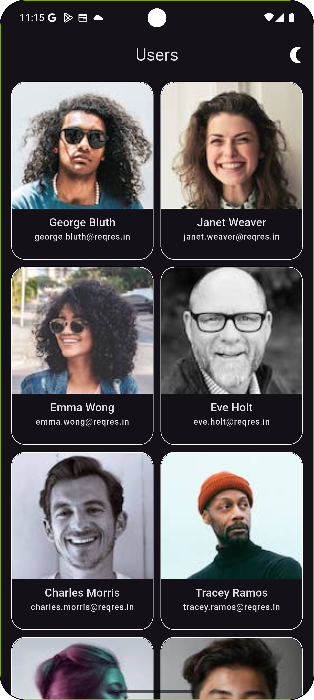
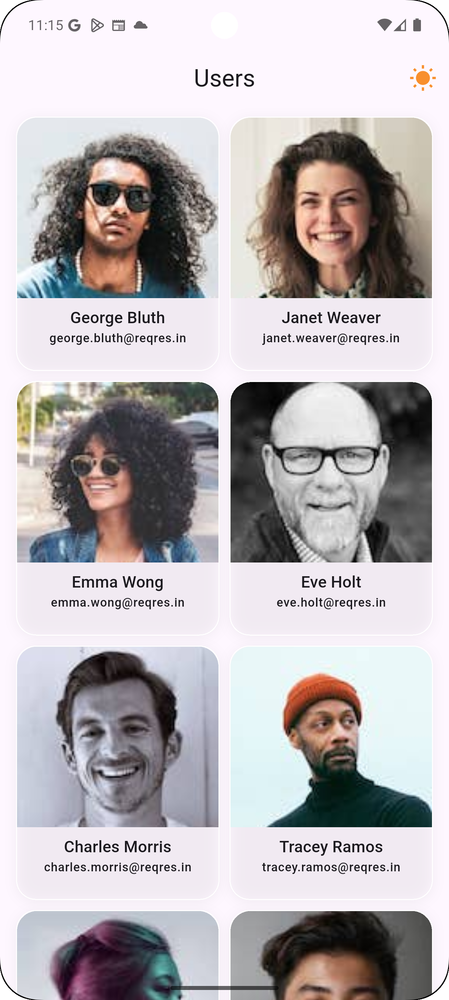
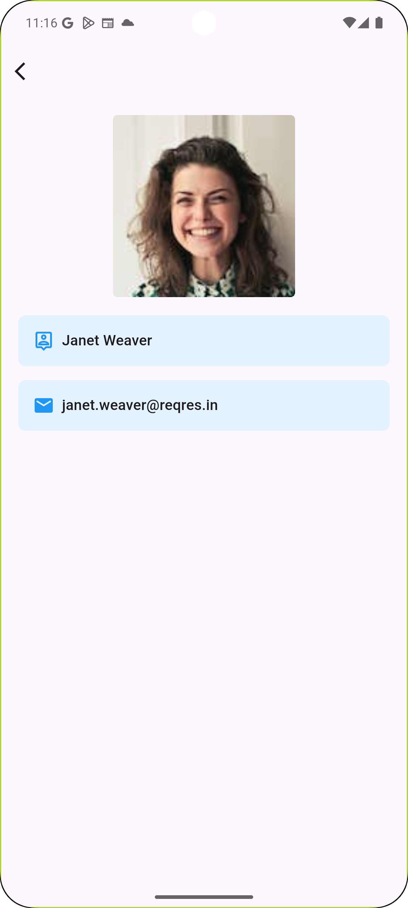
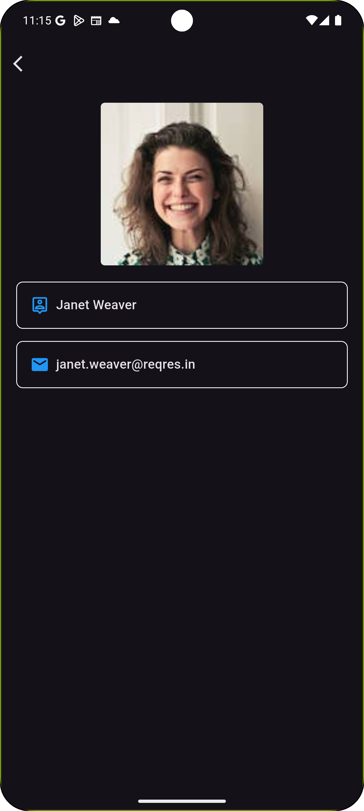

# Flutter User List App with Dark/Light Theme Switch

This Flutter application fetches and displays a list of users from an API, supports switching
between dark and light themes and uses GoRouter for navigation.

    

    

    

---

⚠️ **Warning**:  
This project requires the following versions to run correctly:

- **Flutter**: 3.29.3
- **Dart**: 3.7.2
- **DevTools**: 2.42.3

## Features

- Fetch and display user listing and user details from API ([Reqres](https://reqres.in/api/users)).
- Navigate to a user details screen using **GoRouter**.
- State management using **Bloc**.
- Applying Flutter lints for clean code
- Using **HTTP** package for API calls.
- Network connectivity checking
    - Detects whether the device has an active internet connection.
- Dark/Light theme support with a smooth animated icon (sun 🌞 / moon 🌙).

 
